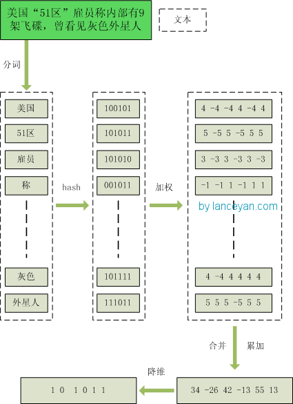

## PostgreSQL bktree 索引using gist例子 - 海明距离检索 - 短文相似、模糊图像搜索      
                                                                  
### 作者                                                                                                                                  
digoal                                                                                                                                                                           
                                                                                    
### 日期                                                                                                                                                                           
2020-03-24                                                                                                                                                                       
                                                                                                                                                                           
### 标签                                                                                                                                                                           
PostgreSQL , 海明码 , 海明距离 , bktree                      
                                                                               
----                                                                         
                                                                                    
## 背景       
https://github.com/fake-name/pg-spgist_hamming    
    
Fast hamming-distance range searches via native GiST Indexing facility in PostgreSQL    
    
```                  
# Enable extension in current database (Note: This is per-database, so if you want to use it on     
# multiple DBs, you'll have to enable it in each.    
CREATE EXTENSION bktree;    
    
# Use the enabled extension to create an index.     
# phash_column MUST be a int64 ("bigint") type.    
CREATE INDEX bk_index_name ON table_name USING spgist (phash_column bktree_ops);    
    
# Query across the table within a specified edit distance.    
SELECT <columns here> FROM table_name WHERE phash_column <@ (target_phash_int64, search_distance_int);    
```    
    
This repository contains two SP-GiST index extensions.    
    
Principally, they detail my progress while implementing a [BK-Tree][1] as a native C PostgreSQL indexing extension. This is extremely useful for certain types of searches, primarily related to fuzzy-image searching.    
    
    
用于短文特征搜索, 例如商品相似搜索.      
  
参考:  
  
https://www.cnblogs.com/jiyuqi/p/4845969.html  
  
simhash是由 Charikar 在2002年提出来的，参考 《Similarity estimation techniques from rounding algorithms》 。 介绍下这个算法主要原理，为了便于理解尽量不使用数学公式，分为这几步：  
  
1、分词，把需要判断文本分词形成这个文章的特征单词。最后形成去掉噪音词的单词序列并为每个词加上权重，我们假设权重分为5个级别（1~5）。比如：“ 美国“51区”雇员称内部有9架飞碟，曾看见灰色外星人 ” ==> 分词后为 “ 美国（4） 51区（5） 雇员（3） 称（1） 内部（2） 有（1） 9架（3） 飞碟（5） 曾（1） 看见（3） 灰色（4） 外星人（5）”，括号里是代表单词在整个句子里重要程度，数字越大越重要。  
  
2、hash，通过hash算法把每个词变成hash值，比如“美国”通过hash算法计算为 100101,“51区”通过hash算法计算为 101011。这样我们的字符串就变成了一串串数字，还记得文章开头说过的吗，要把文章变为数字计算才能提高相似度计算性能，现在是降维过程进行时。  
  
3、加权，通过 2步骤的hash生成结果，需要按照单词的权重形成加权数字串，比如“美国”的hash值为“100101”，通过加权计算为“4 -4 -4 4 -4 4”；“51区”的hash值为“101011”，通过加权计算为 “ 5 -5 5 -5 5 5”。  
  
4、合并，把上面各个单词算出来的序列值累加，变成只有一个序列串。比如 “美国”的 “4 -4 -4 4 -4 4”，“51区”的 “ 5 -5 5 -5 5 5”， 把每一位进行累加， “4+5 -4+-5 -4+5 4+-5 -4+5 4+5” ==》 “9 -9 1 -1 1 9”。这里作为示例只算了两个单词的，真实计算需要把所有单词的序列串累加。  
  
5、降维，把4步算出来的 “9 -9 1 -1 1 9” 变成 0 1 串，形成我们最终的simhash签名。 如果每一位大于0 记为 1，小于0 记为 0。最后算出结果为：“1 0 1 0 1 1”。  
  
原理图：  
  
    
    
    
比smlar更高效.     
      
[《HTAP数据库 PostgreSQL 场景与性能测试之 16 - (OLTP) 文本特征向量 - 相似特征(海明...)查询》](../201711/20171107_17.md)      
      
[《海量数据,海明(simhash)距离高效检索(smlar) - 阿里云RDS PosgreSQL最佳实践》](../201708/20170804_01.md)      
    
  
  
  
  
  
  
  
  
  
  
  
  
  
  
  
  
  
  
  
  
  
  
  
  
  
#### [9.9元购买3个月阿里云RDS PostgreSQL实例](https://www.aliyun.com/database/postgresqlactivity "57258f76c37864c6e6d23383d05714ea")
  
  
#### [PostgreSQL 解决方案集合](https://yq.aliyun.com/topic/118 "40cff096e9ed7122c512b35d8561d9c8")
- [1 任意维度实时圈人](https://yq.aliyun.com/topic/118 "40cff096e9ed7122c512b35d8561d9c8")
- [2 时序数据实时处理](https://yq.aliyun.com/topic/118 "40cff096e9ed7122c512b35d8561d9c8")
- [3 时间、空间、业务 多维数据实时透视](https://yq.aliyun.com/topic/118 "40cff096e9ed7122c512b35d8561d9c8")
- [4 独立事件相关性分析](https://yq.aliyun.com/topic/118 "40cff096e9ed7122c512b35d8561d9c8")
- [5 海量关系实时图式搜索](https://yq.aliyun.com/topic/118 "40cff096e9ed7122c512b35d8561d9c8")
- [6 社交业务案例](https://yq.aliyun.com/topic/118 "40cff096e9ed7122c512b35d8561d9c8")
- [7 流式数据实时处理案例](https://yq.aliyun.com/topic/118 "40cff096e9ed7122c512b35d8561d9c8")
- [8 IoT 物联网, 时序](https://yq.aliyun.com/topic/118 "40cff096e9ed7122c512b35d8561d9c8")
- [9 全文检索](https://yq.aliyun.com/topic/118 "40cff096e9ed7122c512b35d8561d9c8")
- [10 模糊、正则 查询案例](https://yq.aliyun.com/topic/118 "40cff096e9ed7122c512b35d8561d9c8")
- [11 图像识别](https://yq.aliyun.com/topic/118 "40cff096e9ed7122c512b35d8561d9c8")
- [12 向量相似检索](https://yq.aliyun.com/topic/118 "40cff096e9ed7122c512b35d8561d9c8")
- [13 数据清洗、采样、脱敏、批处理、合并](https://yq.aliyun.com/topic/118 "40cff096e9ed7122c512b35d8561d9c8")
- [14 GIS 地理信息空间数据应用](https://yq.aliyun.com/topic/118 "40cff096e9ed7122c512b35d8561d9c8")
- [15 金融业务](https://yq.aliyun.com/topic/118 "40cff096e9ed7122c512b35d8561d9c8")
- [16 异步消息应用案例](https://yq.aliyun.com/topic/118 "40cff096e9ed7122c512b35d8561d9c8")
- [17 海量数据 冷热分离](https://yq.aliyun.com/topic/118 "40cff096e9ed7122c512b35d8561d9c8")
- [18 倒排索引案例](https://yq.aliyun.com/topic/118 "40cff096e9ed7122c512b35d8561d9c8")
- [19 海量数据OLAP处理应用](https://yq.aliyun.com/topic/118 "40cff096e9ed7122c512b35d8561d9c8")
  
  
#### [德哥 / digoal's 趣味入口 - 努力成为灯塔, 公益是一辈子的事.](https://github.com/digoal/blog/blob/master/README.md "22709685feb7cab07d30f30387f0a9ae")
  
  

  
  
#### [PostgreSQL 解决方案集合](https://yq.aliyun.com/topic/118 "40cff096e9ed7122c512b35d8561d9c8")
- [1 任意维度实时圈人](https://yq.aliyun.com/topic/118 "40cff096e9ed7122c512b35d8561d9c8")
- [2 时序数据实时处理](https://yq.aliyun.com/topic/118 "40cff096e9ed7122c512b35d8561d9c8")
- [3 时间、空间、业务 多维数据实时透视](https://yq.aliyun.com/topic/118 "40cff096e9ed7122c512b35d8561d9c8")
- [4 独立事件相关性分析](https://yq.aliyun.com/topic/118 "40cff096e9ed7122c512b35d8561d9c8")
- [5 海量关系实时图式搜索](https://yq.aliyun.com/topic/118 "40cff096e9ed7122c512b35d8561d9c8")
- [6 社交业务案例](https://yq.aliyun.com/topic/118 "40cff096e9ed7122c512b35d8561d9c8")
- [7 流式数据实时处理案例](https://yq.aliyun.com/topic/118 "40cff096e9ed7122c512b35d8561d9c8")
- [8 IoT 物联网, 时序](https://yq.aliyun.com/topic/118 "40cff096e9ed7122c512b35d8561d9c8")
- [9 全文检索](https://yq.aliyun.com/topic/118 "40cff096e9ed7122c512b35d8561d9c8")
- [10 模糊、正则 查询案例](https://yq.aliyun.com/topic/118 "40cff096e9ed7122c512b35d8561d9c8")
- [11 图像识别](https://yq.aliyun.com/topic/118 "40cff096e9ed7122c512b35d8561d9c8")
- [12 向量相似检索](https://yq.aliyun.com/topic/118 "40cff096e9ed7122c512b35d8561d9c8")
- [13 数据清洗、采样、脱敏、批处理、合并](https://yq.aliyun.com/topic/118 "40cff096e9ed7122c512b35d8561d9c8")
- [14 GIS 地理信息空间数据应用](https://yq.aliyun.com/topic/118 "40cff096e9ed7122c512b35d8561d9c8")
- [15 金融业务](https://yq.aliyun.com/topic/118 "40cff096e9ed7122c512b35d8561d9c8")
- [16 异步消息应用案例](https://yq.aliyun.com/topic/118 "40cff096e9ed7122c512b35d8561d9c8")
- [17 海量数据 冷热分离](https://yq.aliyun.com/topic/118 "40cff096e9ed7122c512b35d8561d9c8")
- [18 倒排索引案例](https://yq.aliyun.com/topic/118 "40cff096e9ed7122c512b35d8561d9c8")
- [19 海量数据OLAP处理应用](https://yq.aliyun.com/topic/118 "40cff096e9ed7122c512b35d8561d9c8")
  
