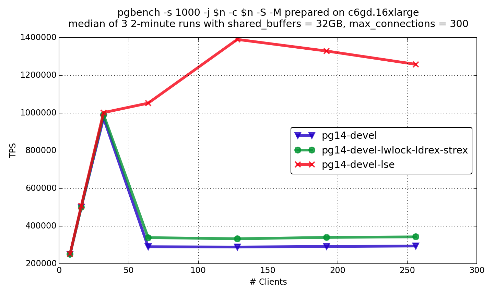
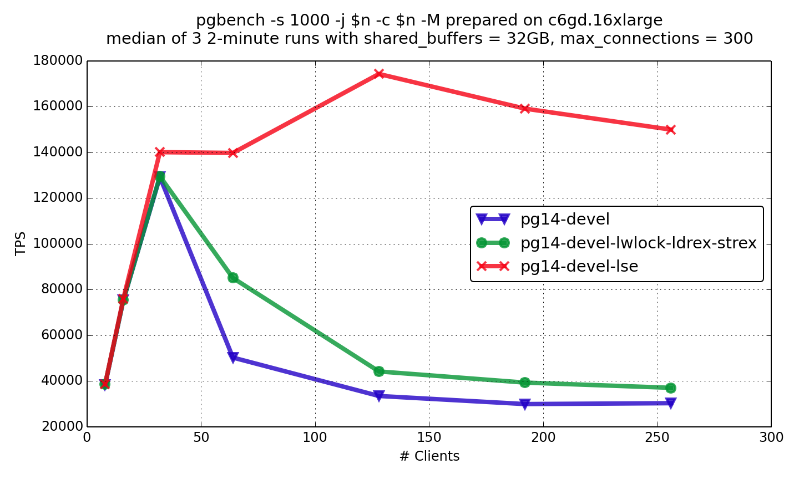

## 老外惊呼: 世界变化快! PostgreSQL 14 on ARM 8.1 加上LSE patch性能飙升到140万tps    
  
### 作者  
digoal  
  
### 日期  
2021-04-30   
  
### 标签  
PostgreSQL , arm , lse , 14    
  
----  
  
## 背景  
  
老外惊呼: 世界变化快!  
  
ARM 8.1 defines a set of LSE instructions, which, in particular, provide the way to implement atomic operation in a single instruction (just like x86).  
  
从性能测试来看, PG 14打了使用lse指令的patch后, 1亿数据量pgbench, 140万只读TPS, 18万读写TPS. arm 8.1 已经和x86相当了. x86 64核 估计也就140万左右tps了.   
  
[转载全文如下]  
  
包含一些测试数据.    
  
https://akorotkov.github.io/blog/2021/04/30/arm/  
  
The world changes. ARM architecture breaks into new areas of computing. An only decade ago, only your mobile, router, or another specialized device could be ARM-based, while your desktop and server were typically x86-based. Nowadays, your new MacBook is ARM-based, and your EC2 instance could be ARM as well.  
  
In the mid-2020, Amazon made graviton2 instances publically available. The maximum number of CPU core there is 64. This number is where it becomes interesting to check PostgreSQL scalability. It’s exciting to check because ARM implements atomic operations using pair of load/store. So, in a sense, ARM is just like Power, where I’ve previously seen a significant effect of platform-specific atomics optimizations.  
  
But on the other hand, ARM 8.1 defines a set of LSE instructions, which, in particular, provide the way to implement atomic operation in a single instruction (just like x86). What would be better: special optimization, which puts custom logic between load and store instructions, or just a simple loop of LSE CAS instructions? I’ve tried them both.  
  
You can see the results of read-only and read-write pgbench on the graphs below (details on experiments are here). pg14-devel-lwlock-ldrex-strex is the patched PostgreSQL with special load/store optimization for lwlock, pg14-devel-lse is PostgreSQL compiled with LSE support enabled.  
  
  
  
  
  
You can see that load/store optimization gives substantial positive effect, but LSE rocks here!  
  
So, if you’re running PostgreSQL on graviton2 instance, make sure you’ve binaries compiled with LSE support (see the instruction) because the effect is dramatic.  
  
BTW, it appears that none of these optimizations have a noticeable effect on the performance of Apple M1. Probably, M1 has a smart enough inner optimizer to recognize these different implementations to be equivalent. And it was surprising that LSE usage might give a small negative effect on Kunpeng 920. It was discouraging for me to know an ARM processor, where single instruction operation is slower than multiple instruction equivalent. Hopefully, processor architects would fix this in new Kunpeng processors.  
  
In general, we see that now different ARM embodiments have different performance characteristics and different effects of optimizations. Hopefully, this is a problem of growth, and it will be overcome soon.  
  
  
  
#### [PostgreSQL 许愿链接](https://github.com/digoal/blog/issues/76 "269ac3d1c492e938c0191101c7238216")
您的愿望将传达给PG kernel hacker、数据库厂商等, 帮助提高数据库产品质量和功能, 说不定下一个PG版本就有您提出的功能点. 针对非常好的提议，奖励限量版PG文化衫、纪念品、贴纸、PG热门书籍等，奖品丰富，快来许愿。[开不开森](https://github.com/digoal/blog/issues/76 "269ac3d1c492e938c0191101c7238216").  
  
  
#### [9.9元购买3个月阿里云RDS PostgreSQL实例](https://www.aliyun.com/database/postgresqlactivity "57258f76c37864c6e6d23383d05714ea")
  
  
#### [PostgreSQL 解决方案集合](https://yq.aliyun.com/topic/118 "40cff096e9ed7122c512b35d8561d9c8")
  
  
#### [德哥 / digoal's github - 公益是一辈子的事.](https://github.com/digoal/blog/blob/master/README.md "22709685feb7cab07d30f30387f0a9ae")
  
  

  
