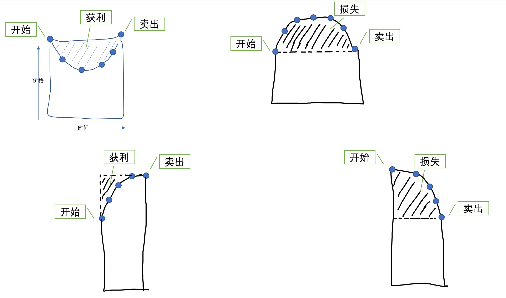

## 德说-第56期, 微笑曲线    
                                                  
### 作者                                                  
digoal                                                  
                                                  
### 日期                                                  
2021-10-29                                                  
                                                  
### 标签                                                  
PostgreSQL , 定额定投 , 基金                             
                                                  
----                                                  
                                                  
## 背景          
    
视频回放: https://www.bilibili.com/video/BV1x34y1o7mC/        
  
参考: 喜马拉雅, 威尼斯摆渡人   
        
微笑曲线是什么?         
    
定额定投收益算法:      
- M表示每一期定投的金额.    
- x1表示第1期基金净值, xn表示第n期基金净值.    
- X表示赎回时的基金净值.     
    
算法:     
- 份额: ` M/x1 + M/x2 + ... + M/xn `      
- 成本面积: ` M * n `     
- 卖出面积: ` (M/x1 + M/x2 + ... M/xn) * X `      
- 收益 = 卖出面积 - 成本面积 - 交易手续费 - 基金托管费         
      
    
1、微笑曲线, 收益最高(当然时间也比半边微笑花进去了更多一点, 算起年化实际上一样).     
2、哭脸, 亏损最大.    
3、半边哭脸, 亏损.    
4、半边微笑, 收益.     
    
    
   
为什么股票不能定投?   
- 因为股票一天的波动就可能大于10%, 你没法找到止盈点.   
- 基金一天的波动还是比较稳定的, 所以在止盈时卖出和预期的差异微乎其微.   
    
      
基金定投的核心思想:      
- 坚持定额定投      
- 所有资金集中定投1只或2只(取决于你的资金能不能覆盖所有定投基金的微笑周期), 而不是选择很多只基金.  
- 设置止盈点(例如年化 10%. 因此, 如果你定投了2年才卖, 收益应该在20%以上作为止盈点), 并且严格执行      
    - 有专门的工具可以计算       
    - 按大多数的情况10%年化的概率很高很高       
    - 还有就是不能有丢在哪几年再去看的错误思想. 一定要设置止盈提醒, 不管什么时候, 到达止盈点就全卖, 然后接着往里定投.   
- 足够多的本金(保证能跨过一个微笑曲线周期, 通常3-5年)      
      
选择什么基金?      
- 宽基指数基金, 波动比较稳定.         
- 微笑周期的频率够高(周期短, 例如一年可以出现几次超过止盈点的微笑), 微笑的坑够大(够深, 就像蓄水池一样, 深的话能获取到的水才多. 当然还和水坑的口径(也就是微笑周期的长度)也有关系), 基金对标的指数跟踪率(跟踪率高才有参考价值).        
    - 如果1年内出现多个微笑曲线, 每次收益率10%, 实际年化必然超过10%        
- 交易费率、托管费率低的。    
- 很多人推荐 中证500       
- 不要选择主动管理的基金(这个能不能赚钱完全取决于基金经理), 一定要选择指数基金(老百姓就靠它用以上的方法赚钱了).  
    
适合什么人群?      
- 非常适合上班族, 每个月有新增的闲钱.       
- 也适合有闲钱的.       
    - 假设微笑曲线周期为12个月, 你的本金为12万, 每个月定投1万刚好走完一次曲线, 赎回后落袋为安.        
      
一直上涨的收益大? 还是下跌+上涨的收益大?      
- 看获益面积就知道了.  (当然时间也比半边微笑花进去了更多一点, 算起年化实际上一样).     
    
定投点太多, 呈现锯齿状? 看不懂收益?      
- 采用数据库抽稀方法:      
    - 把每连续的N次定投合并为1次.       
    - 经过时间的推移, 最终总会找到那个微笑曲线.      
    
哪里买?    
- 银行app就可以买, 例如招行app      
    
遇到哭脸怎么办?      
- 继续定额定投, 经过更多轮的投入, 以及抽稀重绘后都会遇到微笑曲线的.       
    
    
    
    
    
    
  
#### [期望 PostgreSQL 增加什么功能?](https://github.com/digoal/blog/issues/76 "269ac3d1c492e938c0191101c7238216")
  
  
#### [类似Oracle RAC架构的PostgreSQL已开源: 阿里云PolarDB for PostgreSQL云原生分布式开源数据库!](https://github.com/ApsaraDB/PolarDB-for-PostgreSQL "57258f76c37864c6e6d23383d05714ea")
  
  
#### [PostgreSQL 解决方案集合](https://yq.aliyun.com/topic/118 "40cff096e9ed7122c512b35d8561d9c8")
  
  
#### [德哥 / digoal's github - 公益是一辈子的事.](https://github.com/digoal/blog/blob/master/README.md "22709685feb7cab07d30f30387f0a9ae")
  
  

  
