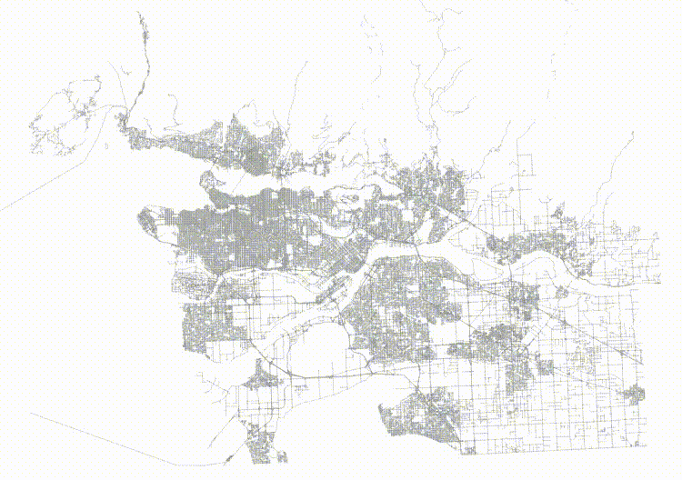
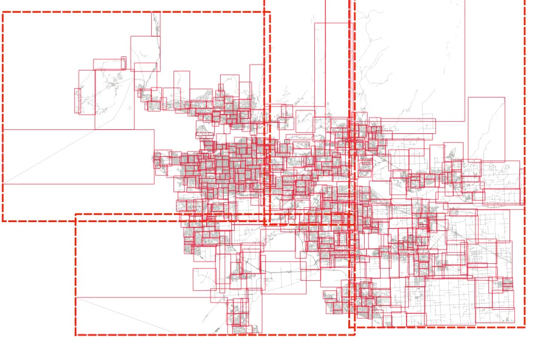
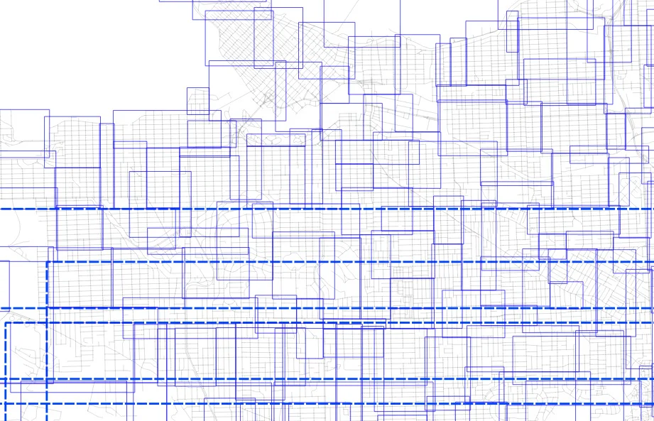
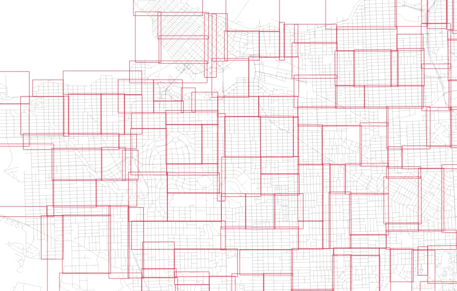

## PostgreSQL GiST 索引受到数据顺序的影响导致性能问题  
      
### 作者      
digoal      
      
### 日期      
2021-12-05      
      
### 标签      
PostgreSQL , GiST , sort , 性能 , SP-GiST , RD-Tree    
      
----      
      
## 背景      
sort加速gist索引的创建速度, 但是可能导致索引不平衡, 影响查询性能  
- [《PostgreSQL 14 preview - gist和sp-gist索引AM支持sort接口, 大幅加速GiST和SP-GiST 索引build速度》](../202104/20210408_07.md)    
- [《PostgreSQL 14 preview  GiST 索引新增openapi: sortsupport - 加速gist索引创建, 紧凑组织gist index page.》](../202009/20200920_02.md)    
  
  
sort加速gist索引的创建速度, 但是可能导致索引不平衡, 影响查询性能  
有序输入的数据, 可能导致创建出来的索引性能不好:   
https://blog.crunchydata.com/blog/tricks-for-faster-spatial-indexes    
  
One of the curious aspects of spatial indexes is that the nodes of the tree can overlap, because the objects being indexed themselves also overlap.  
  
  
  
That means that if you're searching an area in which two nodes overlap, you'll have to scan the contents of both nodes. For a trivial example above, that's not a big deal, but if an index has a lot of overlap, the extra work can add up to a measurable query time difference.  
  
The PostGIS spatial index is based on a R-tree structure, which naturally tries to split nodes into children that have minimized overlap. As the index is built, it automatically tries to conform to the distribution of the data, with more nodes in dense data areas and fewer in sparse areas.  
  
So problem solved, right?  
  
Well no! Because the index is structuring itself based on the inputs it receives, the order of inputs, particularly the early inputs, can have a strong effect on the quality of the final index.  
  
### Sorted vs Random Inputs  
For example, here's a table of roads.  
  
```  
CREATE EXTENSION postgis;  
  
\i roads.sql  
  
CREATE TABLE roads_sorted AS   
  SELECT * FROM roads ORDER BY geom;  
  
CREATE INDEX roads_sorted_idx ON roads_sorted USING GIST (geom);  
```  
  
If we order the roads in a Hilbert curve (which is the default sort order for geometry) we get a table that is highly spatially autocorrelated.  
  
  
  
And then if we visualize the top two levels of the index (using gevel, we can see how the pages look.  
  
  
  
This is not actually a terrible tree! Mostly the nodes don't have a lot of overlap, but the shape of the level one pages (the dotted lines) isn't great, and there's some stretching, both vertically and horizontally.  
  
Now, take the same data and randomize it.  
  
```  
CREATE TABLE roads_random AS   
  SELECT * FROM roads ORDER BY random();  
  
CREATE INDEX roads_random_idx ON roads_random USING GIST (geom);  
```  
  
The table now has no spatial correlation at all.  
  
  
  
And then if we visualize the top two levels of the index, we can see how the pages look.  
  
  
  
The level one nodes are definitely better, but it's hard to see how much better the level two nodes are until you zoom in.  
  
Here's the level one nodes from sorted input.  
  
  
  
And here's the level one nodes from randomized input.  
  
  
  
The nodes for the index built from randomized inputs are just much more nicely arranged to cover the area with minimized overlap.  
  
So it's pretty. So what?  
  
### Different Trees, Different Performance  
In fact, a pretty index performs faster than an ugly one.  
  
To test, we will run a self-join of the table on itself. The query plan is a nested loop join, and the table is 92K records long, so that's 92K index lookups.  
  
```  
# SELECT count(*)   
  FROM roads_sorted a, roads_sorted b   
  WHERE a.geom && b.geom;  
  
 count    
--------  
 505806  
(1 row)  
  
Time: 5229.205 ms (00:05.229)  
  
# SELECT count(*)   
  FROM roads_random a, roads_random b   
  WHERE a.geom && b.geom;  
  
 count    
--------  
 505806  
(1 row)  
  
Time: 4629.745 ms (00:04.630)  
```  
  
So querying on the slightly prettier index is 11% faster.  
  
In general, spatial indexes will end up with a better shape if seeded with randomized inputs. We found the same effect in our in-memory K-D trees, and addressed it both with bulk randomization, and a more clever pre-seeding approach.  
  
### Conclusions  
- Spatial indexes are sensitive to the order of inputs, in particular highly correlated inputs will result in poorly balanced trees and/or poorly arranged trees.  
- Pre-ordering your rows randomly will result in a more balanced tree and measurable improvements in query performance.  
  
## 其他GiST, SP-GiST索引的原理和优化方法  
1、窥察gist索引内部组织结构  
- [《PostgreSQL 14 preview - pageinspect 新增gist索引inspect, 同时支持 lp_dead 展示》](../202102/20210215_03.md)    
- [《PostgreSQL 14 preview - pageinspect 内窥heap,index存储结构 , 新增对gist索引的支持》](../202101/20210113_02.md)    
  
2、gist和sp-gist索引的树结构和原理  
- [《PostgreSQL SP-GiST 索引原理》](../202011/20201128_01.md)    
- [《PostgreSQL GiST 索引原理 - 4》](../202010/20201004_04.md)    
- [《PostgreSQL GiST 索引原理 - 3》](../202010/20201004_03.md)    
- [《PostgreSQL GiST 索引原理 - 2》](../202010/20201004_02.md)    
- [《PostgreSQL GiST 索引原理 - 1》](../202010/20201004_01.md)    
- [《PostgreSQL gist, spgist索引的原理、差别、应用场景》](../201906/20190604_03.md)    
  
3、因索引外部filter导致的索引并不感知满足条件条数, 从而需要full scan index, 带来的性能问题解决方法:  
- [《PostgreSQL GiST Order by 距离 + 距离范围判定 + limit 骤变优化与背景原因》](../201912/20191218_02.md)    
  
4、因cube或bound box的搜寻扩大导致的性能问题和解决方法.   
- [《PostgreSQL 空间切割(st_split, ST_Subdivide)功能扩展 - 空间对象网格化 (多边形GiST优化)》](../201710/20171005_01.md)    
- [《PostgreSQL 空间st_contains，st_within空间包含搜索优化 - 降IO和降CPU(bound box) (多边形GiST优化)》](../201710/20171004_01.md)    
  
5、其他优化手段  
- [《PostGIS空间索引(GiST、BRIN、R-Tree)选择、优化 - 2》](../202105/20210507_05.md)    
- [《PostGIS空间索引(GiST、BRIN、R-Tree)选择、优化 - 阿里云RDS PostgreSQL最佳实践》](../201708/20170820_01.md)    
    
  
#### [期望 PostgreSQL 增加什么功能?](https://github.com/digoal/blog/issues/76 "269ac3d1c492e938c0191101c7238216")
  
  
#### [类似Oracle RAC架构的PostgreSQL已开源: 阿里云PolarDB for PostgreSQL云原生分布式开源数据库!](https://github.com/ApsaraDB/PolarDB-for-PostgreSQL "57258f76c37864c6e6d23383d05714ea")
  
  
#### [PostgreSQL 解决方案集合](https://yq.aliyun.com/topic/118 "40cff096e9ed7122c512b35d8561d9c8")
  
  
#### [德哥 / digoal's github - 公益是一辈子的事.](https://github.com/digoal/blog/blob/master/README.md "22709685feb7cab07d30f30387f0a9ae")
  
  

  
