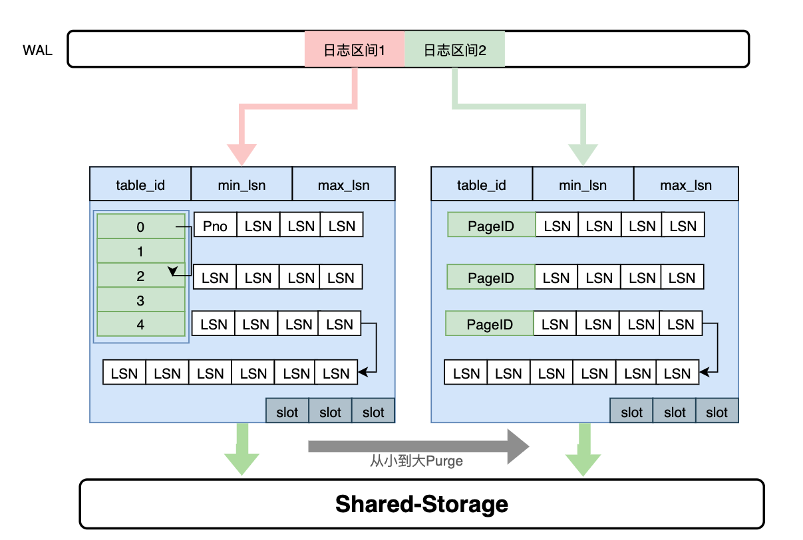
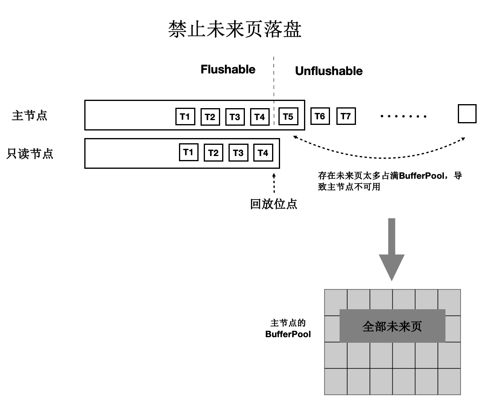

## 一起学PolarDB - 第16期 - 为什么只读实例不能共享一份数据?       
                 
### 作者             
digoal                          
                           
### 日期                      
2022-01-12                   
                   
### 标签      
PostgreSQL , PolarDB      
                         
----                           
                      
## 背景      
懂PostgreSQL, 学PolarDB不难, 就好像有九阳神功护体, 可以快速融会贯通.      
对于DBA只要学会PolarDB精髓即可.      
对于开发者来说不需要学习, 使用PolarDB和PostgreSQL一样.      
      
#### 为什么只读实例不能共享一份数据?    
  
社区版本:    
如果数据是完全静止的, 相对比较容易做到多个计算节点共享一份数据, 类似于FDW. (当然即使某一时刻没有写入, 如果之前有过写入的话, PG还有后台vacuum, freeze操作, 可能会改变数据块的内容.)   
假设数据是动态的, 主实例会对数据进行增删改操作, 那么:  
- 1、主实例的shared buffer、OS page cache中都可能有脏数据.   
- 2、主实例可能正在修改 data block.   
  
由于有以上2种操作的存在, 如果只读实例(RO)和主实例(RW)直接共享存储有什么问题?   
- 1 只读节点从存储中读取的data block，可能是不一致的, 例如有可能是partial write的页面, checksum都不正确.   
- 2 假设当前只读实例上的某个事务的快照是LSN1, 但是在整个事务中读取到的数据块可能存在比较老的版本(指这个block在LSN1之前经过了修改, 并且还没有从shared buffer或page cache中刷到磁盘中)，不符合数据一致性要求。    
- 3 假设当前只读实例上的某个事务的快照是LSN1, 但是在整个事务中读取到的数据块比自身内存中想要的数据要超前(指这个block在LSN1之后经过了修改, 并且已经从shared buffer或page cache中刷到磁盘中, 而且旧的tuple版本也已经被清理)，不符合数据一致性要求。   
- 4 假设只读实例通过回放WAL来同步RW节点的脏页, 由于内存有限, 脏页可能从RO节点的shared buffer淘汰出去, 那么再次访问时必须从共享存储读取data block, 类似2和3, 这个block可能是旧的, 也可能是超前的.    
  
因此, 传统的共享存储架构, 主库在用的时候, 备库是不能启动的。仅仅用户HA.     
  
PolarDB:              
https://github.com/ApsaraDB/PolarDB-for-PostgreSQL/blob/main/doc/PolarDB-CN/Architecture.md  
  
    
  
解决旧页面问题:   
维护每个Page到日志的“倒排”索引, LogIndex本质是一个可持久化的hash数据结构。  
- 1 只读节点通过WAL receiver接收从主节点过来的WAL meta信息。  
- 2 WAL meta记录该条日志修改了哪些Page。  
- 3 将该条WAL meta插入到LogIndex中，key是PageID，value是LSN。  
- 4 一条WAL日志可能更新了多个Page（索引分裂），在LogIndex对有多条记录。  
- 5 同时在BufferPool中给该该Page打上outdate标记，以便使得下次读取的时候从LogIndex重回放对应的日志。  
- 6 当内存达到一定阈值时，LogIndex异步将内存中的hash刷到盘上。  
  
    
  
解决未来页面问题:   
控制刷脏不超过logindex的last LSN.    
- 1 只读节点回放到T4位点。  
- 2 主节点在刷脏时，对所有脏页按照LSN排序，仅刷在T4之前的脏页(包括T4)，之后的脏页不刷。  
- 3 其中，T4的LSN位点称为“一致性位点”。  
  
  
            
本期问题1:        
为什么PG社区版本只读实例不能共享一份数据?    
- a. 只读实例可能读到旧页面  
- b. 只读实例可能读到未来页面  
- c. 只读实例可能读到bad block(partial write导致)  
- d. 只读实例无法通过WAL日志同步主实例的脏数据  
    
答案:                                  
- abc    
           
解释:                              
- 参考本文内容                         
  
本期问题2:        
为什么PolarDB可以共享一份数据?    
- a. 通过logindex存储WAL的倒排数据: pageid和lsn的映射关系, 解决只读实例block从shared buffer被淘汰后从共享存储中可能读到旧页面的问题.  
- b. 控制主实例shared buffer刷脏, 不能将超过logindex last lsn的脏页刷盘. 解决读取到未来页面的问题.   
- c. 所有脏data page都需要从wal回放, 不会出现bac block(partial write导致)    
- d. 只读实例支持logindex, 不需要回放wal的data record, 只需要解析wal中pageid和lsn的映射关系, 并存储到logindex中.   
    
答案:                                  
- abcd    
           
解释:                              
- 参考本文内容        
  
  
  
#### [期望 PostgreSQL 增加什么功能?](https://github.com/digoal/blog/issues/76 "269ac3d1c492e938c0191101c7238216")
  
  
#### [PolarDB for PostgreSQL云原生分布式开源数据库](https://github.com/ApsaraDB/PolarDB-for-PostgreSQL "57258f76c37864c6e6d23383d05714ea")
  
  
#### [PostgreSQL 解决方案集合](https://yq.aliyun.com/topic/118 "40cff096e9ed7122c512b35d8561d9c8")
  
  
#### [德哥 / digoal's github - 公益是一辈子的事.](https://github.com/digoal/blog/blob/master/README.md "22709685feb7cab07d30f30387f0a9ae")
  
  

  
