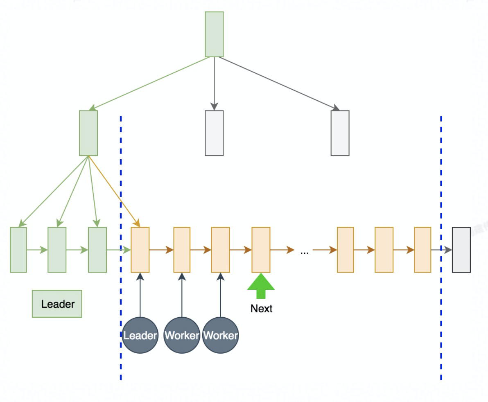
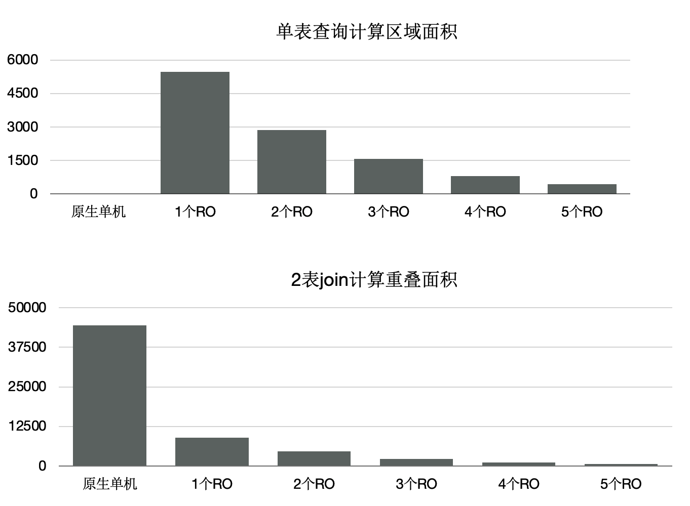

## 一起学PolarDB - 第20期 - 为什么GIS时空查询即耗CPU又费IO?    
        
### 作者        
digoal        
        
### 日期        
2022-01-20       
        
### 标签        
PostgreSQL , PolarDB        
        
----        
        
## 背景        
懂PostgreSQL, 学PolarDB不难, 就好像有九阳神功护体, 可以快速融会贯通.        
对于DBA只要学会PolarDB精髓即可.        
对于开发者来说不需要学习, 使用PolarDB和PostgreSQL一样.        
        
#### 为什么GIS时空查询即耗CPU又费IO?    
比较典型的时空查询包括:  
- 搜索附近的对象. (打车、订餐、交友、酒店、加油站等POI搜索)   
    - 通过 GiST 索引可以支持空间排序 , 但是加入距离条件后需要recheck, 如果再加入limit 且符合条件的数据不足会导致性能骤变. 导致cpu和io浪费. 优化方法如下:   
        - [《PostgreSQL PostGIS 的5种空间距离排序(knn)算法》](../201806/20180605_02.md)    
        - [《GIS附近查找性能优化 - PostGIS long lat geometry distance search tuning using gist knn function》](../201308/20130806_01.md)    
        - [《PostgreSQL GiST Order by 距离 + 距离范围判定 + limit 骤变优化与背景原因》](../201912/20191218_02.md)    
- 输入一个空间多边形, 进行包含查询. (例如 刑侦、热力、政务、车联网等按输入的动态或静态多边形查找在这个多边形内的对象)   
    - 由于索引的root和branch page的entry都是bound box的, 与实际存储的多边形相比, 存在空间放大的问题, 搜索时会出现大了recheck filter rows. 导致cpu和io浪费. 优化方法如下:   
        - [《PostgreSQL 空间切割(st_split, ST_Subdivide)功能扩展 - 空间对象网格化 (多边形GiST优化)》](../201710/20171005_01.md)    
        - [《PostgreSQL 空间st_contains，st_within空间包含搜索优化 - 降IO和降CPU(bound box) (多边形GiST优化)》](../201710/20171004_01.md)    
- 路径规划 (例如网约车调度、快递调度、导航等)   
    - 需要大量数据的叠加时空计算, 耗费IO和CPU较多.   
- 轨迹碰撞 (典型的刑侦场景、舆情场景例如新冠疫情下, 快速找出和病毒携带者轨迹可能有近距离接触的人群)   
    - 需要大量数据的叠加时空计算, 耗费IO和CPU较多.   
- 时空范围内的对象流量、停留时间等维度统计 (促销复盘、热力图统计等场景)   
    - 需要大量数据的时空统计计算, 耗费IO和CPU较多.   
  
社区版本:         
通过以上的优化方法后, 如果还要提升性能怎么办? 用并行scan?    
  
可是目前只有btree索引支持并行scan:    
  
```  
grep -r amcanparallel *  
brin/brin.c:	amroutine->amcanparallel = false;  
gin/ginutil.c:	amroutine->amcanparallel = false;  
gist/gist.c:	amroutine->amcanparallel = false;  
hash/hash.c:	amroutine->amcanparallel = false;  
nbtree/nbtree.c:	amroutine->amcanparallel = true;  
spgist/spgutils.c:	amroutine->amcanparallel = false;  
  
  
  
/*  
 * API struct for an index AM.  Note this must be stored in a single palloc'd  
 * chunk of memory.  
 */  
typedef struct IndexAmRoutine  
{  
...  
        /* does AM support parallel scan? */  
        bool            amcanparallel;  
        /* does AM support columns included with clause INCLUDE? */  
        bool            amcaninclude;  
        /* does AM use maintenance_work_mem? */  
        bool            amusemaintenanceworkmem;  
        /* OR of parallel vacuum flags.  See vacuum.h for flags. */  
        uint8           amparallelvacuumoptions;  
  
```  
  
为了使用并行计算, 需要将表进行分区, 通过parallel table scan (enable_parallel_append)来实现多分区并行加速.    
但是最多也只能用到单个实例的能力(受制于单实例的cpu和IO能力), 无法多实例并行.    
  
分区可能引入一些其他的问题:  [《每天5分钟,PG聊通透 - 系列1 - 热门问题 - 链接、驱动、SQL - 第20期 - 为什么分区表的分区过多会导致性能下降?》](../202112/20211224_01.md)    
- 分区是偏静态的(将来要调整分区规则, 分区边界的话需要DDL操作),    
- PG社区版本目前没有全局索引, 全局约束. 如果有这方面的需求就不能分区.    
  
截止到目前的PG版本(14), 分区过多也会有一些问题:     
    
问题1: 分区过多, 对于一些老版本的PG, 优化器在生成path后才会裁剪分区, 分区过多会使得生成执行计划非常耗时. 对于短平快的SQL, 性能损耗尤为突出.      
- 老的PG版本可能使用pg_pathman进行此类优化(裁剪优化)    
    
问题2: relcache 缓存暴增, 老版本的PG会缓存所有的分区元数据. 即使是优化后的PG新版本, 如果业务使用了长连接, 假使每个会话在会话的整个生命周期内访问过每个子分区的话, 同样会导致relcache占用内存过多, 使得每个会话占有大量内存. 甚至触发OOM.    
    
问题3: 当SQL没有输入分区字段作为条件时, 需要访问所有分区, 分区过多会导致执行计划时间超长. 同时可能某些更优的访问路径就无法支持(例如某些情况下hashagg, hashjoin, merge join等可能无法支持)        
- 目前未支持分区表全局索引, 所以按非分区字段排序需要访问所有分区, 使用merge sort方式进行优化.   
- 不含分区字段的过滤, 无法裁剪分区, 即使有索引也需要访问所有分区, 需要访问更多数据块(每个本地索引的meta page, branch page, leaf page).    
  
PolarDB:         
  
1、优化器支持GiST并行扫描.     
  
  
  
2、优化器支持多节点(RW+RO)并行扫描     
  
```  
数据量：40000 万，500 GB  
规格：5 个只读节点，每个节点规格为 16 核 CPU、128 GB 内存  
性能：  
随 CPU 数目线性提升, 共 80 核 CPU 时，提升71 倍  
```  
  
  
        
本期问题1:        
时空查询为什么即使使用GiST索引依旧存在CPU和IO放大的问题?   
- a. GiST的索引root,branch节点采用bound box作为边界, 所以搜索到叶子结点后, 还需要做一些 recheck 计算   
- b. 需要遍历整个GiST索引  
- c. GiST 索引是lossy类型的索引      
- d. GiST 索引存在页面膨胀    
        
答案:        
- a   
        
解释:        
- 参考本文内容        
      
本期问题2:        
PostgreSQL 14社区版支持并行的索引扫描方法有哪些?   
- a. GiST   
- b. SP-GiST   
- c. btree   
- d. BRIN    
        
答案:        
- c   
        
解释:        
- 参考本文内容     
  
本期问题3:        
PolarDB 对时空扫描做了哪些优化?   
- a. GiST 索引支持并行扫描  
- b. 不使用bound box来作为索引的内部key value边界  
- c. 支持将RW和RO节点列入并行扫描, 执行一条SQL可以同时用到多个计算节点  
- d. 支持GiST的精准过滤, 在叶子结点不需要recheck 计算  
        
答案:        
- ac   
        
解释:        
- 参考本文内容     
  
本期问题4:        
当时空扫描存在cpu和io放大时, 业务上如何优化的性价比最高?   
- a. 切分输入条件, 尽量缩小bound box的覆盖范围  
- b. 使用函数或递归查询, 迅速检测到limit的边界条件, 防止符合条件的记录数不足limit条数时需要扫描整个gist索引的内容  
- c. 采用并行计算, 暴力加速  
- d. 采用分区表    
        
答案:        
- ab  
        
解释:        
- 参考本文内容     
  
  
#### [期望 PostgreSQL 增加什么功能?](https://github.com/digoal/blog/issues/76 "269ac3d1c492e938c0191101c7238216")
  
  
#### [PolarDB for PostgreSQL云原生分布式开源数据库](https://github.com/ApsaraDB/PolarDB-for-PostgreSQL "57258f76c37864c6e6d23383d05714ea")
  
  
#### [PostgreSQL 解决方案集合](https://yq.aliyun.com/topic/118 "40cff096e9ed7122c512b35d8561d9c8")
  
  
#### [德哥 / digoal's github - 公益是一辈子的事.](https://github.com/digoal/blog/blob/master/README.md "22709685feb7cab07d30f30387f0a9ae")
  
  

  
